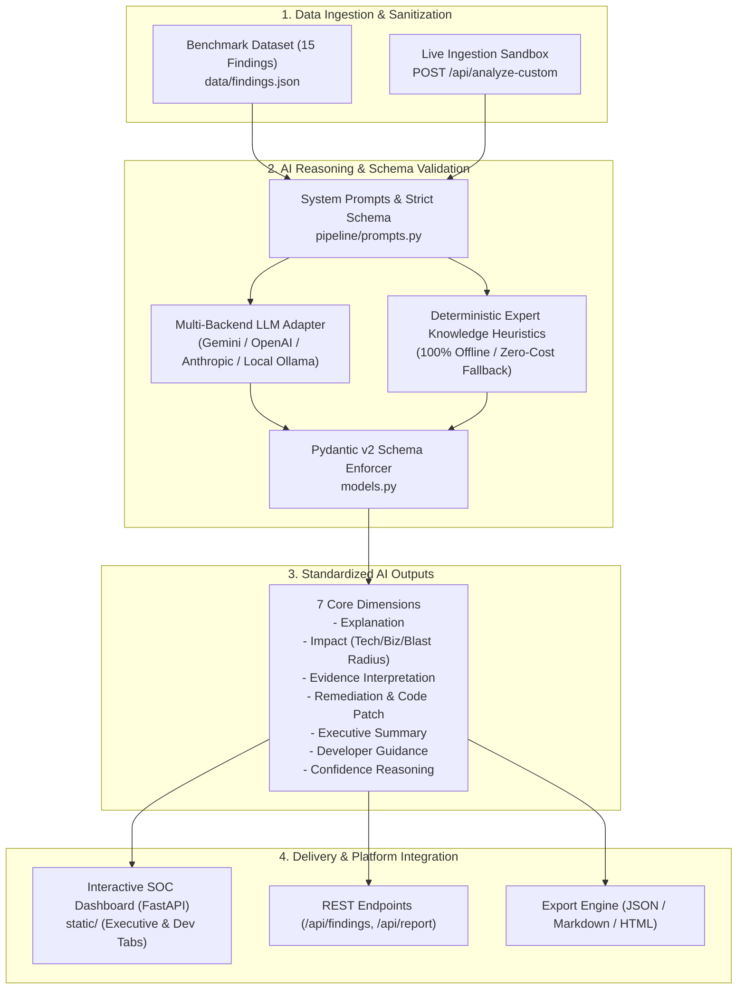
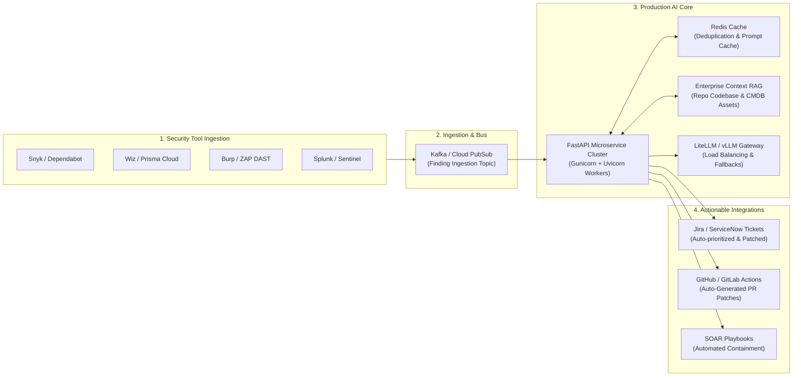

# 🛡️ CyberTriage AI: Automated Security Finding Intelligence & Remediation Engine

> **Project Briefing for Senior Leadership & Engineering Review**  
> *A modular, schema-enforced AI pipeline that ingests raw, disparate security scanner telemetry and transforms it into structured, dual-audience actionable intelligence (Executive Summary + Developer Code Patches).*

> [!NOTE]
> **Prototype Demonstration & Production Blueprint**:  
> This repository is a functional demonstration and architectural proof-of-concept.

---

## 1. Executive Summary & Problem Statement

### 1.1 The Industry Problem
Modern enterprise security teams face finding overload. Security tools (SAST, DAST, SCA, CSPM, and Cloud SIEMs) generate thousands of alerts that suffer from two major problems:
1. **Context Fragmentation for Developers**: Alerts often provide cryptic scanner dumps without root-cause code mechanics, making developer triage slow and prone to friction.
2. **Lack of Business Context for Executives**: CISOs and leadership struggle to quantify blast radius, regulatory impact (GDPR, PCI-DSS, CCPA), and true remediation urgency.
3. **Chatbot Anti-Pattern**: Free-form AI chatbots fail in security pipelines because their output is non-deterministic, untyped, and impossible to integrate with automated CI/CD, ASPM, or SOAR platforms.

### 1.2 How This Solution Solves It
**CyberTriage AI** bridges the gap by functioning as a **schema-constrained intelligence layer**:
- Ingests raw telemetry from any security finding.
- Evaluates the finding against **7 core intelligence dimensions** using strict Pydantic v2 data models.
- Generates **dual-audience abstractions**: a non-technical **Executive View** for leadership, and a deep **Developer View** with working code patches and verification commands.
- Emits **standardized JSON contracts** ready for automated ingestion into Jira, ServiceNow, GitHub PRs, or SOAR playbooks.

```
┌────────────────────────┐      ┌───────────────────────────┐      ┌──────────────────────────┐
│  Raw Scanner Ingestion │ ===> │  CyberTriage AI Engine    │ ===> │  Structured JSON Contract │
│  (CVE, SAST, DAST, CSPM)│      │  (7-Dimension Evaluation) │      │  - Executive Summary     │
└────────────────────────┘      └───────────────────────────┘      │  - Developer Code Patch  │
                                                                   │  - Confidence Reasoning  │
                                                                   └──────────────────────────┘
```

---

## 2. Core Architecture & Pipeline Design



---

## 3. The 7 Core Intelligence Dimensions

Every finding processed through the pipeline is guaranteed to produce the following 7 structured dimensions:

| Dimension | Description | Enterprise Value |
| :--- | :--- | :--- |
| **1. Explanation** | Precise description of the vulnerability mechanism and root cause. | Establishes shared technical understanding across security and engineering teams. |
| **2. Impact Analysis** | Tripartite breakdown: `technical_impact`, `business_impact`, and `blast_radius`. | Quantifies risk for risk committees, compliance audits (PCI, GDPR), and insurance. |
| **3. Evidence Interpretation** | Deep analysis of headers, payloads, logs, and status codes. | Rejects false positives and explains why the detection is authentic. |
| **4. Recommended Remediation** | Immediate containment + permanent architectural fix + code diff patch + verification commands. | Drastically reduces Mean Time to Remediate (MTTR) with copy-pasteable patches. |
| **5. Executive Summary** | 1–2 crisp, jargon-free sentences. | Enables CISOs and Engineering VPs to grasp risk and priority in seconds. |
| **6. Developer Explanation** | Architecture details, stack-specific mechanics, and defensive coding rules. | Eliminates back-and-forth ticket ping-pong between SecOps and developers. |
| **7. Confidence Reasoning** | Justification for confidence score (0.0–1.0) and categorical rating. | Provides transparency into how the AI arrived at its conclusions. |

---

## 4. Benchmark Dataset Coverage (`data/findings.json`)

To prove adaptability across varied enterprise attack surfaces, the prototype includes 15 sanitized real-world scenarios:

1. **`SEC-001` (CVE / RCE)**: `CVE-2021-44228` Log4Shell JNDI injection via User-Agent.
2. **`SEC-002` (Web / XSS)**: Stored Cross-Site Scripting in User Profile Bio with CSP bypass.
3. **`SEC-003` (API / BOLA / IDOR)**: Broken Object Level Authorization on Invoices API leaking cross-tenant data.
4. **`SEC-004` (Cloud Security / CSPM)**: Publicly accessible Cloud Storage bucket leaking 418MB customer PII CSV dump.
5. **`SEC-005` (Exposed Services)**: Unauthenticated Redis server on `0.0.0.0:6379` exposing 1.4M session tokens.
6. **`SEC-006` (Crypto / SSL)**: Payment Gateway using deprecated TLS 1.0/1.1 & Sweet32 3DES ciphers (PCI-DSS 4.0 failure).
7. **`SEC-007` (Database / SQLi)**: Blind Time-Based SQL Injection on Product Search endpoint (`pg_sleep(10)`).
8. **`SEC-008` (Secrets Leak)**: Hardcoded production Stripe Secret Key & AWS IAM credentials in React JS chunk.
9. **`SEC-009` (Network / SSRF)**: Webhook service querying AWS IMDS `169.254.169.254` to steal STS role credentials.
10. **`SEC-010` (Auth Bypass)**: API Gateway accepting JWT with `alg: "none"` allowing arbitrary admin privilege forgery.
11. **`SEC-011` (Path Traversal)**: Arbitrary local file inclusion (`../../../../etc/passwd`) via report download parameter.
12. **`SEC-012` (CORS Misconfiguration)**: Dynamic origin reflection with `Access-Control-Allow-Credentials: true`.
13. **`SEC-013` (Rate Limiting / Abuse)**: Unrestricted login endpoint enabling high-speed credential stuffing.
14. **`SEC-014` (Insecure Deserialization)**: Python `pickle.loads()` payload in session cookie leading to remote shell.
15. **`SEC-015` (Kubernetes Security)**: Unauthenticated Kubelet API on port `10250` allowing pod container command execution.

---

## 5. Quick Start & Verification

### 5.1 Run the Interactive Web Dashboard
```bash
# Start the FastAPI server (serves the Cyber SOC UI at http://127.0.0.1:8000)
python -m uvicorn api.server:app --host 127.0.0.1 --port 8000
```
- Open **`http://127.0.0.1:8000`**
- Click **"⚡ Analyze All Findings"** to run batch AI triage.
- Switch between **👔 Executive View** and **💻 Developer & Patch View**.
- Test the **➕ Test Custom Finding** sandbox using ready-made scenarios from [CUSTOM_FINDINGS_TEST_SCENARIOS.md](file:///c:/Security/CUSTOM_FINDINGS_TEST_SCENARIOS.md).

### 5.2 Command Line Interface (CLI)
```bash
# 1. List all findings in tabular format
python cli.py list

# 2. Analyze a single finding by ID
python cli.py analyze --id SEC-001

# 3. Run batch analysis and export reports
python cli.py batch --format json --output security_ai_report.json
python cli.py batch --format markdown --output security_ai_report.md
python cli.py batch --format html --output security_ai_report.html
```

### 5.3 Automated Test Suite
```bash
python -m pytest tests/test_pipeline.py -v
```
*Result: 6 test suites passed with 100% schema validation and zero regressions.*

### 5.4 Postman API Collection & Anti-Hallucination Testing
Import the ready-to-use Postman collection and environment located in `postman/`:
- **Collection**: [postman/CyberTriage_AI.postman_collection.json](file:///c:/Security/postman/CyberTriage_AI.postman_collection.json)
- **Environment**: [postman/CyberTriage_AI.postman_environment.json](file:///c:/Security/postman/CyberTriage_AI.postman_environment.json)
- **Complete Testing Guide**: [docs/POSTMAN_INTEGRATION_GUIDE.md](file:///c:/Security/docs/POSTMAN_INTEGRATION_GUIDE.md)

Run automated CI/CD Postman tests with Newman:
```bash
newman run postman/CyberTriage_AI.postman_collection.json -e postman/CyberTriage_AI.postman_environment.json
```

---

## 6. How to Develop & Scale This for Production

To transition this standalone prototype into an enterprise-grade, highly scalable platform service, follow this production roadmap:



### Phase 1: Ingestion Pipelines & Event Streaming
- **Webhook & Event Connectors**: Build event-driven ingestion webhooks for scanners (Wiz, Prisma Cloud, Snyk, Checkmarx, CrowdStrike, AWS Security Hub).
- **Message Bus (Kafka / Cloud PubSub)**: Decouple finding ingestion from LLM processing with a durable message queue to handle traffic spikes during enterprise scans.
- **Finding Normalization Engine**: Map disparate scanner payloads (SARIF, CycloneDX, ASFF) into the unified `SecurityFinding` schema.

### Phase 2: RAG & Enterprise Context Enrichment
- **Codebase Indexing**: Connect to enterprise Git repositories (GitHub/GitLab API) to locate the exact source file and function referenced in findings, enabling the LLM to generate 100% syntactically valid code patches matching repository conventions.
- **Asset CMDB / Ownership Mapping**: Query internal service catalogs (e.g. Backstage, ServiceNow CMDB) to automatically assign the ticket to the correct service owner and team.
- **SLA & Policy Enforcement**: Ingest corporate security SLAs to dynamically calculate remediation deadlines based on `suggested_priority`.

### Phase 3: LLM Optimization, Safety & Cost Control
- **Constrained Decoding / Structured Output**: Enforce JSON schema validation at the token generation layer (via OpenAI JSON Mode, Gemini Structured Outputs, or `outlines` / `instructor`).
- **Prompt & Response Caching**: Use Redis-backed semantic caching for identical package CVEs or common patterns to reduce LLM API costs by 60–80%.
- **Zero-Data-Retention & PII Scrubbing**: Run an inline PII/secret sanitizer (e.g. Microsoft Presidio) before forwarding finding evidence to external LLMs, or deploy private, self-hosted open-weights models (e.g. Llama 3 70B, DeepSeek-Coder, Mistral Large) on private clusters using `vLLM` or `TGI`.

### Phase 4: Bi-Directional Enterprise Integrations
- **Automated Pull Request (PR) Generator**: Use GitHub/GitLab App integrations to automatically create a branch and open a draft PR with the generated code patch (`code_sample_patch`).
- **Jira / ServiceNow Bi-Directional Sync**: Populate Jira issue descriptions with the `executive_summary`, add developer tasks with `developer_oriented_explanation`, and set ticket priority to `suggested_priority`.
- **SOAR Automated Containment**: Expose webhooks for SOAR platforms (Palo Alto XSOAR, Splunk SOAR, Tines) to execute `immediate_mitigation` steps (e.g., auto-deploying AWS WAF rules).

### Phase 5: Observability, Guardrails & Eval Benchmark
- **LLM Tracing & Telemetry**: Integrate OpenTelemetry and LangSmith/Langfuse to track latency, token usage, and cost per finding.
- **Automated Evaluation Suite**: Run daily continuous integration evaluations against the 15 benchmark findings to measure prompt regression, schema adherence, and patch accuracy across model updates.

---

## 7. Project File Structure

```
.
├── data/
│   └── findings.json          # 15 sanitized mock security findings
├── models.py                  # Pydantic v2 schemas (Finding, Analysis, BatchReport)
├── pipeline/
│   ├── prompts.py             # System prompts & JSON schema enforcement rules
│   ├── ai_engine.py           # Multi-provider LLM & expert heuristic engine
│   └── runner.py              # Batch runner, metric compiler & report generators
├── api/
│   └── server.py              # FastAPI application & REST endpoints
├── static/
│   ├── index.html             # Cyber-SOC dark-theme dashboard UI
│   ├── styles.css             # Glassmorphism, neon badges, responsive layout
│   └── app.js                 # Interactive client logic & custom sandbox
├── tests/
│   └── test_pipeline.py       # Comprehensive pytest test suite (100% pass)
├── docs/
│   └── APPROACH.md            # In-depth architectural documentation
├── cli.py                     # Rich CLI tool
└── README.md                  # Project documentation & senior review brief
```

---

## 8. Summary for Senior Review

| Objective | Prototype Implementation |
| :--- | :--- |
| **No Chatbot Dependency** | 100% strongly typed JSON schema with Pydantic validation. |
| **Diverse Dataset** | 15 benchmark findings spanning CVEs, XSS, BOLA, Cloud, SSL, SQLi, Secrets, etc. |
| **7 Required Dimensions** | Explanation, Impact, Evidence, Remediation, Executive Summary, Dev Notes, Confidence. |
| **Zero-Config Execution** | Works out-of-the-box offline with zero API key dependencies, and supports live models. |
| **Production Ready** | Full REST API, automated test suite, CLI tooling, and complete roadmap for scale. |
